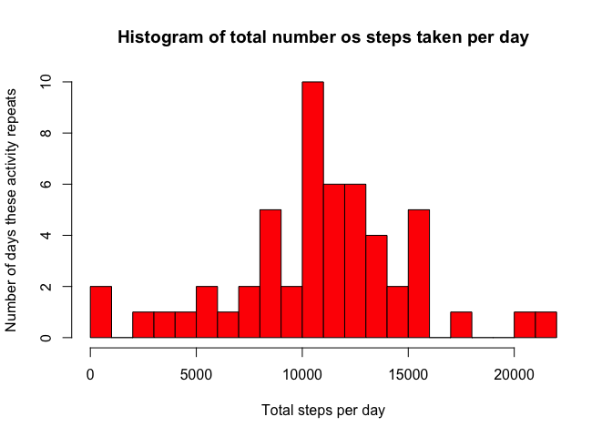
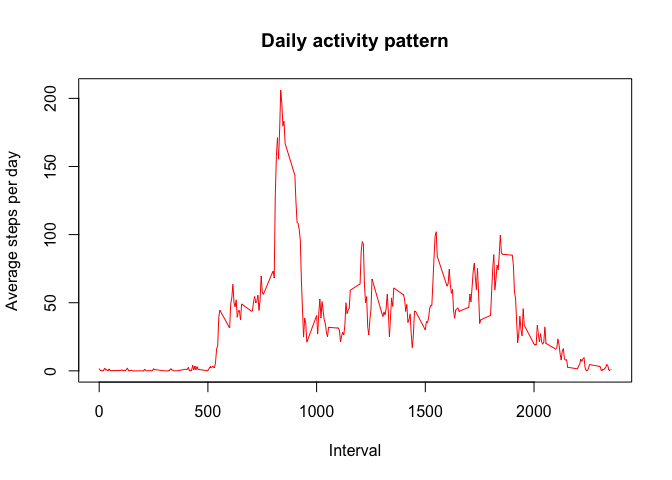
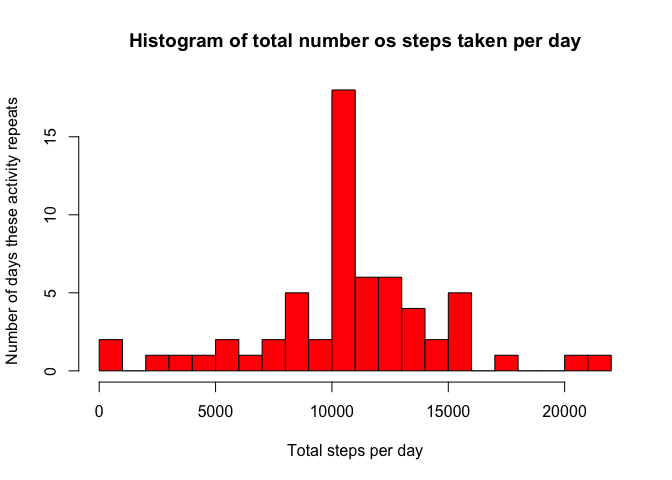
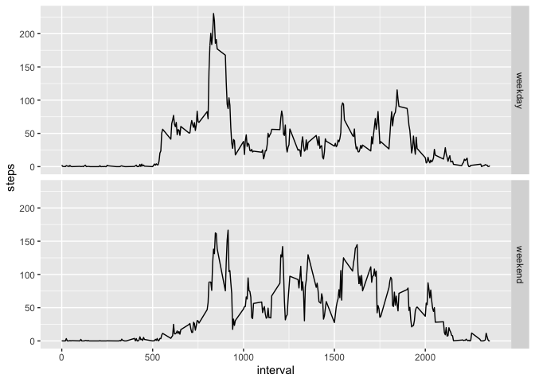

## Loading and preprocessing the data

Uncompress, loads and prints sample:


```r
unzip("activity.zip")
activity <- read.csv("activity.csv")
str(activity)
```

```
## 'data.frame':	17568 obs. of  3 variables:
##  $ steps   : int  NA NA NA NA NA NA NA NA NA NA ...
##  $ date    : Factor w/ 61 levels "2012-10-01","2012-10-02",..: 1 1 1 1 1 1 1 1 1 1 ...
##  $ interval: int  0 5 10 15 20 25 30 35 40 45 ...
```

```r
head(activity)
```

```
##   steps       date interval
## 1    NA 2012-10-01        0
## 2    NA 2012-10-01        5
## 3    NA 2012-10-01       10
## 4    NA 2012-10-01       15
## 5    NA 2012-10-01       20
## 6    NA 2012-10-01       25
```

## What is mean total number of steps taken per day?

1. Calculate the total number of steps taken per day:


```r
with_steps <- activity[!is.na(activity$steps),]
daily_steps <- aggregate(with_steps["steps"], by=with_steps["date"], FUN=sum)
head(daily_steps)
```

```
##         date steps
## 1 2012-10-02   126
## 2 2012-10-03 11352
## 3 2012-10-04 12116
## 4 2012-10-05 13294
## 5 2012-10-06 15420
## 6 2012-10-07 11015
```

2. If you do not understand the difference between a histogram and a barplot,
research the difference between them. Make a histogram of the total number of
steps taken each day


```r
hist(daily_steps$steps,
     main = "Histogram of total number os steps taken per day",
     xlab = "Total steps per day",
     ylab = "Number of days these activity repeats",
     col = c("red"),
     breaks = 20)
```

<!-- -->

3. Calculate and report the mean and median of the total number of steps taken per day


```r
average_steps_per_day <- mean(daily_steps$steps)
average_steps_per_day
```

```
## [1] 10766.19
```

```r
median_steps_per_day <- median(daily_steps$steps)
median_steps_per_day
```

```
## [1] 10765
```

## What is the average daily activity pattern?

1. Make a time series plot (i.e. type = "l") of the 5-minute interval (x-axis)
and the average number of steps taken, averaged across all days (y-axis)


```r
per_interval <- aggregate(
    with_steps["steps"],
    by=with_steps["interval"],
    FUN=mean)
head(per_interval)
```

```
##   interval     steps
## 1        0 1.7169811
## 2        5 0.3396226
## 3       10 0.1320755
## 4       15 0.1509434
## 5       20 0.0754717
## 6       25 2.0943396
```

```r
plot(per_interval$interval,
     per_interval$steps,
     main = "Daily activity pattern",
     ylab = "Average steps per day",
     xlab = "Interval",
     type = "l",
     col = c("red"))
```

<!-- -->
  
2. Which 5-minute interval, on average across all the days in the dataset,
contains the maximum number of steps?


```r
max_steps = max (per_interval$steps)
per_interval[per_interval$steps == max_steps, "interval"]
```

```
## [1] 835
```

## Imputing missing values

1. Calculate and report the total number of missing values in the dataset
(i.e. the total number of rows with NAs)


```r
nrow(activity[is.na(activity$steps),])
```

```
## [1] 2304
```

2. Devise a strategy for filling in all of the missing values in the dataset.
The strategy does not need to be sophisticated. For example, you could use the
mean/median for that day, or the mean for that 5-minute interval, etc.

*Median for that 5-minutes interval will be used*

3. Create a new dataset that is equal to the original dataset but with the missing
data filled in.


```r
per_interval_copy <- per_interval
names(per_interval_copy)[names(per_interval_copy)=="steps"] <- "median_steps_interval"

activity_fill <- merge(activity, per_interval_copy)

activity_fill[is.na(activity_fill$steps), "steps"] <-
    activity_fill[is.na(activity_fill$steps), "median_steps_interval"]
activity_fill <- activity_fill[, names(activity_fill)!="median_steps_interval"]
```

4. Make a histogram of the total number of steps taken each day and Calculate
and report the mean and median total number of steps taken per day.
Do these values differ from the estimates from the first part of the assignment?
What is the impact of imputing missing data on the estimates of the total daily
number of steps?


```r
daily_steps_fill <- aggregate(activity_fill["steps"], by=activity_fill["date"], FUN=sum)
head(daily_steps_fill)
```

```
##         date    steps
## 1 2012-10-01 10766.19
## 2 2012-10-02   126.00
## 3 2012-10-03 11352.00
## 4 2012-10-04 12116.00
## 5 2012-10-05 13294.00
## 6 2012-10-06 15420.00
```

```r
hist(daily_steps_fill$steps,
     main = "Histogram of total number os steps taken per day",
     xlab = "Total steps per day",
     ylab = "Number of days these activity repeats",
     col = c("red"),
     breaks = 20)
```

<!-- -->

```r
average_steps_per_day_fill <- mean(daily_steps_fill$steps)
average_steps_per_day_fill
```

```
## [1] 10766.19
```

```r
median_steps_per_day_fill <- median(daily_steps_fill$steps)
median_steps_per_day_fill
```

```
## [1] 10766.19
```

*No big changes on the numbers computed previously.*

## Are there differences in activity patterns between weekdays and weekends?

1. Create a new factor variable in the dataset with two levels – “weekday” and
“weekend” indicating whether a given date is a weekday or weekend day.


```r
Sys.setlocale("LC_TIME", "en_US")
```

```
## [1] "en_US"
```

```r
activity_fill$weekday <- weekdays(
    as.Date(activity_fill$date, abbreviate = TRUE))

activity_fill[
    activity_fill$weekday %in% c("Sunday", "Saturday"),
    "weekday_type"] <- "weekend"

activity_fill[is.na(activity_fill$weekday_type), "weekday_type"] <- "weekday"
activity_fill$weekday_type <- factor(activity_fill$weekday_type)

str(activity_fill)
```

```
## 'data.frame':	17568 obs. of  5 variables:
##  $ interval    : int  0 0 0 0 0 0 0 0 0 0 ...
##  $ steps       : num  1.72 0 0 0 0 ...
##  $ date        : Factor w/ 61 levels "2012-10-01","2012-10-02",..: 1 54 28 37 55 46 20 47 38 56 ...
##  $ weekday     : chr  "Monday" "Friday" "Sunday" "Tuesday" ...
##  $ weekday_type: Factor w/ 2 levels "weekday","weekend": 1 1 2 1 2 1 2 1 1 2 ...
```

2. Make a panel plot containing a time series plot (i.e. type = "l") of the
5-minute interval (x-axis) and the average number of steps taken, averaged
across all weekday days or weekend days (y-axis). See the README file in the
GitHub repository to see an example of what this plot should look like using
simulated data.


```r
per_interval_n_weekday <- aggregate(
    activity_fill["steps"],
    by=activity_fill[c("interval", "weekday_type")],
    FUN=mean)

library(plyr)
library(ggplot2)

qplot(
  interval,
  steps,
  data = per_interval_n_weekday,
  facets = weekday_type ~ .,
  geom = c("line"))
```

<!-- -->
 
 


